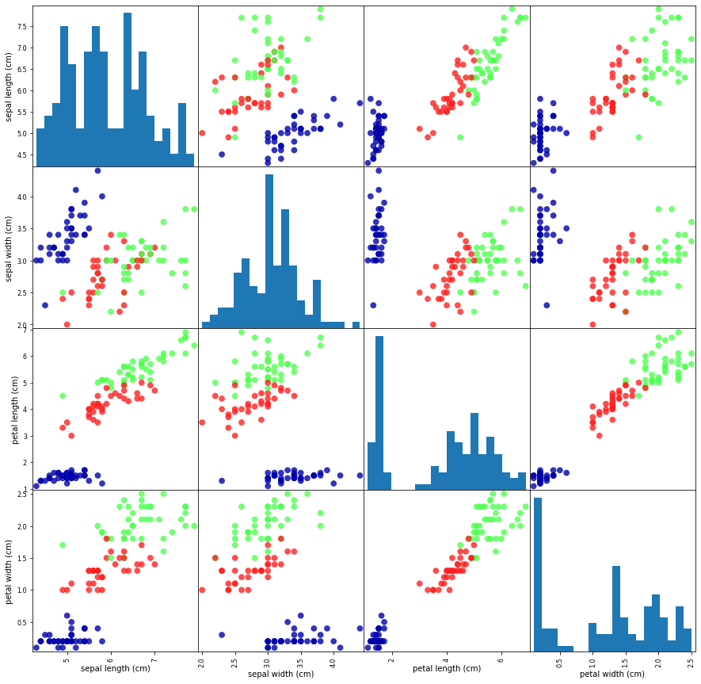

# Pythonで始める機械学習

## 1章はじめに

### Irisデータでの練習メモ


#### 基本的なpythonのメモ

ライブラリのインポート
```
from sklearn.datasets import load_iris
```
のようなコードはskleran.datasetsの下にあるload_irisをインポートしているだけ。
単純なインポートはimportでおｋ

---
表示させる系
```
display(iris_dataset.keys())
```
displayする

---

配列の範囲
```
display(iris_dataset[data][:100])
```
コロンで配列の要素の範囲指定ができる。
↑だと0〜100番目までが出る。

---

配列の要素数
```
display(iris_dataset[data].shape)
```
配列の要素数がでる。(150,4)みたいな

---

#### train_test_split (sklearnのメソッド)

```
from sklearn.model_selection import train_test_split
X_train , X_test , y_train, y_test = train_test_split(
    iris_dataset['data'] , iris_dataset['target'] , random_state = 0)
```
train_test_splitでデータセットを訓練セット、テストセットに分けられる。75%を訓練にして、25%をテストにしてくれる。random_stateは固定しておく方が良い。

第一引数はデータ、第二引数はラベル(データがそれぞれどの分類になるのか)


### 大事そうなこと：データをよく観察する

* データを検査することで、異常値や不整合を確認する。
* もっとも良い方法は可視化させること

#### 可視化の手段
* 散布図
    * 散布図とはx軸にある特徴量を、y軸にもう1つの特徴量を取り、データポイントごとにドットをプロットするもの
    * 基本的には2つの特徴量しかプロットできないが、ペアプロットという手法で回避できる。
    * Irisの場合は特徴量が4つなので、この手法がうまくいく。

```
iris_dataframe = pd.DataFrame(X_train , columns = iris_dataset.feature_names)
grr = pd.plotting.scatter_matrix(iris_dataframe , c = y_train , figsize=(15,15) , marker = 'o', hist_kwds={'bins':20},s=60,alpha=.8,cmap=mglearn.cm3)
```

で散布図出せるけど、読み方が全く分からん。




#### k-最近傍法

```
from sklearn.neighbors import KNeighborsClassifier
knn = KNeighborsClassifier(n_neighbors=1)
knn.fit(X_train,y_train)
```
これでk-最近傍法される

#### 作ったモデルを使う

```
X_new = np.array([[5,2.9,1,0.2]])
prediction = knn.predict(X_new)
display(prediction)
display(iris_dataset['target_names'][prediction])
>> array([0])
>> array(['setosa'], dtype='<U10')
```
こんな感じ


#### モデルの評価

```
y_pred = knn.predict(X_test)
display(y_pred)
>> array([2, 1, 0, 2, 0, 2, 0, 1, 1, 1, 2, 1, 1, 1, 1, 0, 1, 1, 0, 0, 2, 1, 0, 0, 2, 0, 0, 1, 1, 0, 2, 1, 0, 2, 2, 1, 0, 2])

np.mean(y_pred == y_test)
>> 0.9736842105263158
```
ほかにも
```
knn.score(X_test , y_test)
>> 0.9736842105263158
```

97%の精度で分類できている！


#### まとめのコード

ここまでやった事を最小でまとめると、こう！

```
X_train , X_test , y_train , y_test = train_test_split(iris_dataset['data'] , iris_dataset['target'], random_state = 0)

knn = KNeighborsClassifier(n_neighbors=1)
knn.fit(X_train,y_train)
display(knn.score(X_test,y_test))
>> 0.9736842105263158
```


. 