# Pythonで始める機械学習

常に書くっぽいやつはめもっておく

```
import sys
import pandas as pd
import matplotlib
import matplotlib.pyplot as plt
import numpy as np
import scipy as sp
import IPython
import sklearn
import mglearn
%matplotlib inline
```


## 2章：教師あり学習


### pythonぽい書き方のやつ
```
print("Sample counts per class : \n {}".format(
    {n: v for n , v in zip(cancer.target_names , np.bincount(cancer.target))})
)
>> Sample counts per class : 
>> {'malignant': 212, 'benign': 357}
```

#### np.bincount
```
array = [0,1,1,5]
count = np.bincount(array)  -> [1,2,0,0,0,1] 
ans = np.argmax(count)  -> 1
```
bincountの引数の配列の要素内の値が何個あるかを調べてくれる。
cancer例題の場合はtarget_nameの順に0か1（陽性か陰性か）が入っている。


### k-最近傍法の特徴
(以下の部分、ほんとか怪しいと思っている)

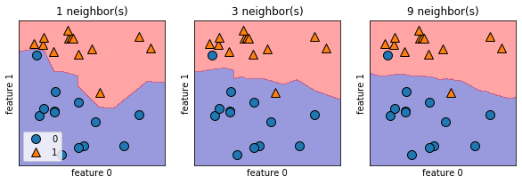

左から近傍点1,3,9

この境界線を決定境界という


* 近傍点の数を1とかにすると、学習データに対して最適になる
    * = 複雑度の高いモデルに対応する
* 近傍点の数を増やすと滑らかになる
    * 滑らかな境界はより単純なモデルに最適化する
* 極端なケースとして、近傍点を全てのデータポイントと同じにすると、そのデータセットに対して最適なモデルになる
    * これが過学習？

#### いい感じの決定境界探し

```
from sklearn.datasets import load_breast_cancer

cancer = load_breast_cancer()
X_train , X_test , y_train , y_test = train_test_split(
    cancer.data , cancer.target , stratify = cancer.target , random_state = 66)

training_accuracy = []
test_accuracy = []

neighbors_settings = range(1,11)

for n_neighbors in neighbors_settings:
    clf = KNeighborsClassifier(n_neighbors=n_neighbors)
    clf.fit(X_train,y_train)
    training_accuracy.append(clf.score(X_train,y_train))
    test_accuracy.append(clf.score(X_test,y_test))
    
plt.plot(neighbors_settings , training_accuracy , label="training accuracy")
plt.plot(neighbors_settings , test_accuracy , label = "test accuracy")
plt.ylabel("Accuracy")
plt.xlabel("n_neighbors")
plt.legend()
```

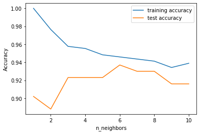

近傍点が6のあたりが、テストのデータを試した感じいい感じ。


### k-近傍回帰

k-最近傍法の亜種

KNeighborsRegressorで使える

```
fig , axes = plt.subplots(1,3,figsize=(15,4))
line = np.linspace(-3,3,1000).reshape(-1,1)
for n_neighbors , ax in zip([1,3,9], axes):
    reg = KNeighborsRegressor(n_neighbors=n_neighbors)
    reg.fit(X_train,y_train)
    ax.plot(line , reg.predict(line))
    ax.plot(X_train,y_train, '^' , c=mglearn.cm2(0) , markersize=8)
    ax.plot(X_test,y_test, 'v' , c=mglearn.cm2(1) , markersize=8)
    
    ax.set_title(
        "{} neighbors train score : {:.2f} test score : {:.2f}".format(
            n_neighbors , reg.score(X_train , y_train),
            reg.score(X_test,y_test)))
    
    ax.set_xlabel("Feature")
    ax.set_ylabel("Target")

axes[0].legend(["Model predictions" , "Training data/target","Test data/target"] , loc="best")
```

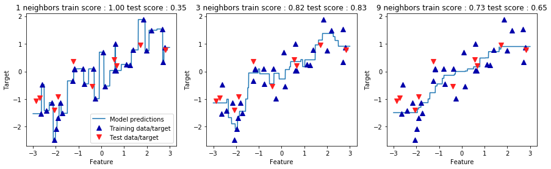

3あたりが、テストデータにフィットしていそう

### 最近傍法、近傍回帰の注意

* データポイントや特徴量の多いデータには向かない（遅い）ので、実際にはあまり使われない
* けど、単純にデフォでやっただけでも精度は結構出るので、まずはここを起点に考えると良い


### 線形回帰

#### 最小二乗法


```
from sklearn.linear_model import LinearRegression
X,y = mglearn.datasets.make_wave(n_samples=60)
X_train,X_test,y_train,y_test = train_test_split(X,y,random_state=42)

lr = LinearRegression().fit(X_train,y_train)

display(lr.coef_)
display(lr.intercept_)

>> array([0.39390555])
>> -0.031804343026759746
```

線形回帰に調整パラメーターはない。

* 傾きを表すパラメーター(w)は、重み、もしくは係数(coefficient)といわれ coef_ に格納される
* オフセットもしくは切片(intercept , b)はintercept_ に格納される
* coef_ とか intercept_ の最後のアンダーバーは訓練データから得られたパラメーターを表す
* scikit-learnではユーザーが設定したパラメーターと明確に区分するために、こういう仕様になっている。


#### 線形回帰の注意

* データセットが多くの特徴量を持つ場合（ボストンの例だと104の特徴量で506のサンプル)は過剰適合してしまいがち
* 訓練セットのscoreは高いがテストセットへの適合率が低い時とかはその兆候

#### そんな時に、リッジ回帰

```
from sklearn.linear_model import Ridge

ridge = Ridge().fit(X_train,y_train)
display(ridge.score(X_train,y_train))
display(ridge.score(X_test,y_test))

>> 0.8857966585170941
>> 0.7527683481744755
```

* リッジ回帰は alpha 引数で正則化(せいそくか)できる
* デフォルトは alpha = 1 
* ↑で見れるように、リッジ回帰は訓練データへの適合は低いけど、テストデータへの適合は高い（より汎化している）
* リッジ回帰は過剰適合の危険は少ない
* 最良の alpha はデータセットに依存する


```
ridge10 = Ridge(alpha=10).fit(X_train,y_train)
display(ridge10.score(X_train,y_train))
display(ridge10.score(X_test,y_test))

>> 0.7882787115369614
>> 0.6359411489177311
```

* alphaが増えるほと過剰適合していく

```
ridge01 = Ridge(alpha=0.1).fit(X_train,y_train)
display(ridge01.score(X_train,y_train))
display(ridge01.score(X_test,y_test))

>> 0.9282273685001987
>> 0.7722067936479814
``` 

* alphaが減ると適合不足になる。

それをグラフでみるには以下

```
plt.plot(ridge.coef_ , 's' , label="Ridge alpha=1")
plt.plot(ridge10.coef_ , 's' , label="Ridge alpha=10")
plt.plot(ridge01.coef_ , 's' , label="Ridge alpha=0.1")

plt.plot(lr.coef_ , 'o' ,label="LinearRegression")
plt.xlabel("Coefficient index")
plt.ylabel("Coefficient magnitude")
plt.hlines(0,0,len(lr.coef_))
plt.ylim(-25,25)
plt.legend()
```

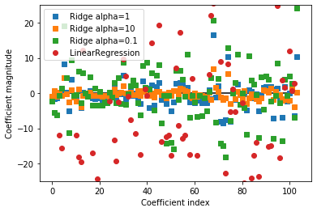

* x軸は coef_ の要素を表す
* x=0 は最初の特徴量に対する係数、x=1は2番目の特徴量に対する係数となって、100まで続いている
* alpha=10 の時は殆どの特徴量が-3から3の範囲に収まっている
* alpha=1 はちょっと上下の範囲がばらついている
* alpha=0.1 の時はかなりばらついている


#### Lasso

Ridgeとは別の線形回帰のやつ
* いくつかのデータを完全に無視するのが特徴

```
from sklearn.linear_model import Lasso

lasso = Lasso().fit(X_train , y_train)
display(lasso.score(X_train,y_train))
display(lasso.score(X_test,y_test))
np.sum(lasso.coef_ != 0)

>> 0.29323768991114596
>> 0.20937503255272272
>> 4
```

* デフォだとめちゃくちゃ弱い
* 4つしか特徴量使ってない

```
lasso001 = Lasso(alpha=0.01 , max_iter=100000).fit(X_train,y_train)

display(lasso001.score(X_train,y_train))
display(lasso001.score(X_test,y_test))
display(np.sum(lasso001.coef_ != 0))

>> 0.8962226511086497
>> 0.7656571174549983
>> 33
```

* alphaが小さくなるとより複雑なデータに適合するようになる

```
lasso00001 = Lasso(alpha=0.0001 , max_iter=100000).fit(X_train,y_train)

display(lasso00001.score(X_train,y_train))
display(lasso00001.score(X_test,y_test))
display(np.sum(lasso00001.coef_ != 0))

>> 0.9507158754515462
>> 0.6437467421273558
>> 96
```
* alpha小さくしすぎると正則化の効果が薄れて過剰適合する


#### クラス分類の為の線形モデル

* ロジスティック回帰と線形サポートベクターマシン

```
# ロジスティック回帰
linear_model.LogisticRegression 

# 線形サポートベクタマシン
svm.LinearSVC
```

forgeデータでおためし

```
from sklearn.linear_model import LogisticRegression
from sklearn.svm import LinearSVC

X,y = mglearn.datasets.make_forge()

fig, axes = plt.subplots(1,2, figsize=(10,3))

for model, ax in zip([LinearSVC(),LogisticRegression()], axes):
    clf = model.fit(X,y)
    mglearn.plots.plot_2d_separator(clf , X , fill=False , eps=0.5 , ax=ax , alpha=.7)
    mglearn.discrete_scatter(X[:,0] , X[:,1] , y , ax=ax)
    ax.set_title("{}".format(clf.__class__.__name__))
    ax.set_xlabel("Feature 0")
    ax.set_ylabel("Feature 1")

axes[0].legend
```

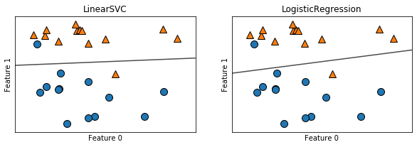

* LogisticRegressionとLinearSVCの正則化強度を決定するパラメータはCと言われる
* Cが大きくなると正則化が弱くなる（訓練データに適合度をあげる）
* Cが小さくなるとデータポイントの「大多数」に対して適合しようとする（この辺が面白い特徴らしい）


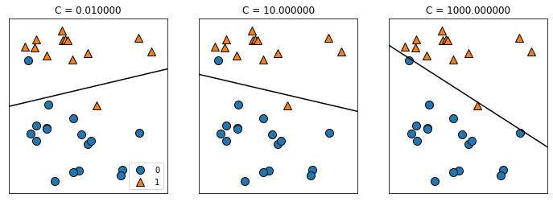

* Cが小さい〜大きいまでの決定境界
* 小さすぎると境界が水平に近くなって、大きすぎると過剰適合


別のデータでやってみる

```
from sklearn.datasets import load_breast_cancer
cancer = load_breast_cancer()
X_train,X_test,y_train,y_test = train_test_split(cancer.data , cancer.target , stratify=cancer.target , random_state = 42)
logreg = LogisticRegression().fit(X_train,y_train)

display(logreg.score(X_train,y_train))
display(logreg.score(X_test,y_test))

>> 0.9530516431924883
>> 0.958041958041958
```

#### 線形モデルによる多クラス分類

* 基本線形モデルは多クラス分類できないので、1対nでそれっぽい感じにする

```
from sklearn.datasets import make_blobs

X,y = make_blobs(random_state=42)
mglearn.discrete_scatter(X[:,0] , X[:,1] , y)
plt.xlabel("Feature 0")
plt.ylabel("Feature 1")
plt.legend(["Class 0", "Class 1" , "Class 2"])
```

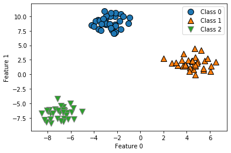

```
linear_svm = LinearSVC().fit(X,y)
display(linear_svm.coef_.shape)
display(linear_svm.intercept_.shape)

>> (3, 2)
>> (3,)
```


```
mglearn.discrete_scatter(X[:,0] , X[:,1] , y)
line = np.linspace(-15,15)
for coef , intercept , color in zip(linear_svm.coef_ , linear_svm.intercept_ , ['b','r','g']):
    plt.plot(line, -(line * coef[0] + intercept) / coef[1], c=color)

plt.ylim(-10 , 15)
plt.xlim(-10 , 8)
plt.xlabel("Feature 0")
plt.ylabel("Feature 1")
plt.legend(["Class 0","Class 1","Class 2", "Line class 0","Line class 1","Line class 2"], loc=(1.01,0.3))

```

* それぞれのクラスの決定境界はこう

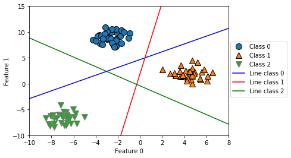


```
mglearn.plots.plot_2d_classification(linear_svm , X , fill=True , alpha=.7)
mglearn.discrete_scatter(X[:,0] , X[:,1] , y)
ine = np.linspace(-15,15)
for coef , intercept , color in zip(linear_svm.coef_ , linear_svm.intercept_ , ['b','r','g']):
    plt.plot(line, -(line * coef[0] + intercept) / coef[1], c=color)

plt.ylim(-10 , 15)
plt.xlim(-10 , 8)
plt.xlabel("Feature 0")
plt.ylabel("Feature 1")
plt.legend(["Class 0","Class 1","Class 2", "Line class 0","Line class 1","Line class 2"], loc=(1.01,0.3))
```

* こんな感じ

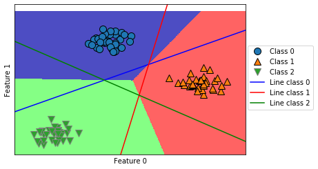


#### 利点・欠点・パラメータ

* 回帰モデルではalpha
* LinbearSVCとLogisticRegressionではC
* alphaが大きいとき、Cが小さいときは単純なモデルに適合する
* 線形モデルは高速、大きいデータセットにも適用できる
* デメリット何書いてるかよくわからんかった


#### ナイーブベイズクラス分類器

* 線形モデルによく似た分類器
* 高速だけど、LogisticRegressionとかLinearSVCとかより汎化性能が劣る場合が多い
* scikit-learn には GaussianNB , BernoulliNB , MultinomialNB が実装されている
* GaussianNBは任意の連続値データに適用できる
* BernoulliNBは2値データを仮定されている
* MultinomialNBはカウントデータを仮定している
    * カウントデータは例えば、文中に出てくる単語の出現数など


#### 決定木

* Yes/No で答えられる質問で構成された、階層的な木構造を学習する
* 決定木の学習は正解に最も早く辿り着けるようなYes/No型の質問を学習すること
* 個々のテストは1つの特徴量しかもたない(Yes/Noなので)常に軸に平行な境界を持つ
* 1つの対象値になるまで(pureという)やると過剰適合
* ↑葉が純粋、みたいな言い方をする
* それを防ぐために　事前枝刈り(pre-pruning)　、　事後枝刈り(post-pruning)　を行う
* scikit-learnでは、決定木は DecisionTreeRegressor(連続値に使う) と DecisionTreeClassifier(離散値に使う) が実装されている
* どちらも事前枝刈りしか実装されていない

事前枝刈り

```
from sklearn.tree import DecisionTreeClassifier
from sklearn.datasets import load_breast_cancer

cancer = load_breast_cancer()
X_train,X_test,y_train,y_test = train_test_split(
    cancer.data , cancer.target , stratify=cancer.target , random_state=42)
tree = DecisionTreeClassifier(random_state=0)
tree.fit(X_train,y_train)
display(tree.score(X_train,y_train))
display(tree.score(X_test,y_test))

>> 1.0
>> 0.9370629370629371
```

* ↑　は訓練セットに対して100%、pureになっている（過剰適合している）
* これを max_depth=4 にしてやると...


```
tree = DecisionTreeClassifier(max_depth=4 , random_state= 0)
tree.fit(X_train,y_train)

display(tree.score(X_train,y_train))
display(tree.score(X_test,y_test))

>> 0.9882629107981221
>> 0.951048951048951
```

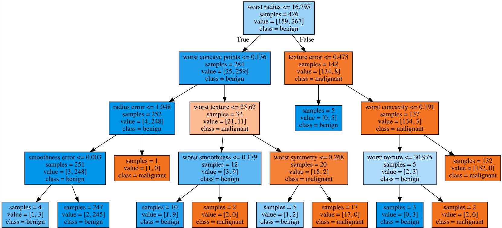

こんな感じで出る


#### 特徴量の重要度

* 個々の特徴量がどの程度重要かを示す割合
* 0-1の間で表され、総和は1
* 0がまったく使われていない
* 1は完全にターゲットを予測できる

```
print("Feature Importances:\n{}".format(tree.feature_importances_))

>> Feature Importances:
[0.         0.         0.         0.         0.         0.
 0.         0.         0.         0.         0.01019737 0.04839825
 0.         0.         0.0024156  0.         0.         0.
 0.         0.         0.72682851 0.0458159  0.         0.
 0.0141577  0.         0.018188   0.1221132  0.01188548 0.        ]
 ```

特徴量の重要度の可視化

```
def plot_feature_importances_cancer(model):
    n_features = cancer.data.shape[1]
    plt.barh(range(n_features), model.feature_importances_ , align='center')
    plt.yticks(np.arange(n_features), cancer.feature_names)
    plt.xlabel("Feature importance")
    plt.ylabel("Feature")

plot_feature_importances_cancer(tree)
```

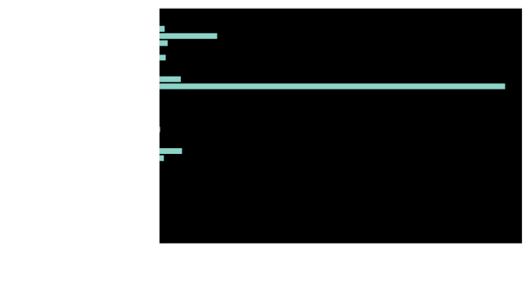

* どの特徴量が重要かを表すが、それがどういう結果になるかとは別なので注意


#### DecisionTreeRegressor

* 回帰決定木
* 使い方はクラス分類決定木とほとんど同じ
* 回帰の場合は外挿(extrapolate)ができない。(訓練データのレンジの外側には対応しない)

```
from sklearn.tree import DecisionTreeRegressor
from sklearn.linear_model import LinearRegression

data_train = ram_prices[ram_prices.date < 2000]
data_test = ram_prices[ram_prices.date >= 2000]

X_train = data_train.date[:,np.newaxis]
y_train = np.log(data_train.price)

tree = DecisionTreeRegressor().fit(X_train, y_train)
linear_reg = LinearRegression().fit(X_train,y_train)


X_all = ram_prices.date[:,np.newaxis]

pred_tree = tree.predict(X_all)
pred_lr = linear_reg.predict(X_all)

price_tree = np.exp(pred_tree)
price_lr = np.exp(pred_lr)

plt.semilogy(data_train.date, data_train.price , label="Training data")
plt.semilogy(data_test.date, data_test.price , label="Test data")
plt.semilogy(ram_prices.date, price_tree, label="Tree prediction")
plt.semilogy(ram_prices.date, price_lr , label="Linear prediction")
plt.legend()
```


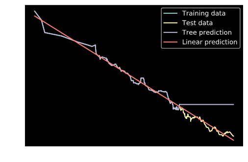

* 線形回帰の方はテストデータに対してもそこそこフィットしている
* 回帰決定木は訓練データの外側のデータには全く適合していない
* ただし、訓練データの範囲内には「完璧に」適合している
* 決定木は事前枝刈をしたとしても単体では過剰適合しがちで、実際には次に見るアンサンブル法が用いられる


### ランダムフォレスト

* 決定木のデメリットは過剰適合しやすい事
* ランダムフォレストとは、複数の決定木をたくさん集めたもので、個々の決定木は過剰適合していてもそれらを寄せ集めて平均を取ることで過剰適合の度合いを減らす手法


```
from sklearn.ensemble import RandomForestClassifier
from sklearn.datasets import make_moons

X , y = make_moons(n_samples=100 , noise=0.25 , random_state= 3)
X_train , X_test , y_train , y_test = train_test_split(X,y,stratify = y,random_state=42)

forest = RandomForestClassifier(n_estimators=5 , random_state=2)
forest.fit(X_train,y_train)

fig , axes = plt.subplots(2,3,figsize=(20,10))
for i , (ax, tree) in enumerate(zip(axes.ravel(),forest.estimators_)):
    ax.set_title("Tree {}".format(i))
    mglearn.plots.plot_tree_partition(X_train,y_train,tree,ax=ax)

mglearn.plots.plot_2d_separator(forest,X_train,fill=True,ax=axes[-1,-1],alpha=.4)
axes[-1,-1].set_title("Random Forest")
mglearn.discrete_scatter(X_train[:,0], X_train[:,1], y_train)
```

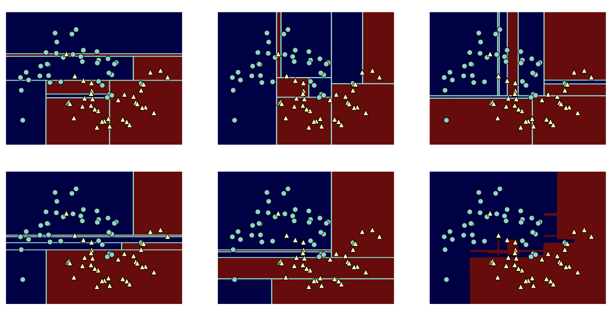


こんな感じ


```
X_train , X_test , y_train , y_test = train_test_split(cancer.data , cancer.target , random_state=0)
forest = RandomForestClassifier(n_estimators=100,random_state=0)
forest.fit(X_train,y_train)

print("Accuracy on training set : {:.3f}".format(forest.score(X_train,y_train)))
print("Accuracy on test set: {:.3f}".format(forest.score(X_test,y_test)))

>> Accuracy on training set : 1.000
>> Accuracy on test set: 0.972
```

* 何もパラメータ調整してなくても97%の精度が出ている！
* max_features や 事前枝刈りを行うことでチューニングはできるが、大抵の場合デフォルトでも十分に機能する


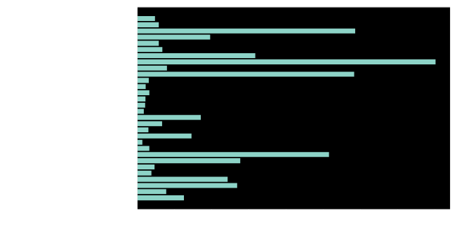

* ランダムフォレストの時の特徴量の重要度
* 単体の決定木よりはるかに複雑になっている


### 勾配ブースティング回帰木(勾配ブースティングマシン)

* 回帰ってあるけど、回帰にも分類にも使える


```
from sklearn.ensemble import GradientBoostingClassifier

X_train , X_test , y_train , y_test = train_test_split(cancer.data , cancer.target , random_state = 0)

gbrt = GradientBoostingClassifier(random_state=0)
gbrt.fit(X_train,y_train)

print("Accuracy on training set: {:.3f}".format(gbrt.score(X_train,y_train)))
print("Accuracy on test set: {:.3f}".format(gbrt.score(X_test,y_test)))

>> Accuracy on training set: 1.000
>> Accuracy on test set: 0.965
```
* 訓練に対して100%になっているので過剰適合している。事前枝刈りをしてやればいい。

```
gbrt = GradientBoostingClassifier(random_state=0,max_depth=1)
gbrt.fit(X_train,y_train)

print("Accuracy on training set: {:.3f}".format(gbrt.score(X_train,y_train)))
print("Accuracy on test set: {:.3f}".format(gbrt.score(X_test,y_test)))

>> Accuracy on training set: 0.991
>> Accuracy on test set: 0.972
```
* もしくは学習率を下げてやる

```
gbrt = GradientBoostingClassifier(random_state=0,learning_rate=0.01)
gbrt.fit(X_train,y_train)

print("Accuracy on training set: {:.3f}".format(gbrt.score(X_train,y_train)))
print("Accuracy on test set: {:.3f}".format(gbrt.score(X_test,y_test)))

>> Accuracy on training set: 0.988
>> Accuracy on test set: 0.965
```

* 可視化

```
gbrt = GradientBoostingClassifier(random_state=0,max_depth=1)
gbrt.fit(X_train,y_train)

plot_feature_importances_cancer(gbrt)
```

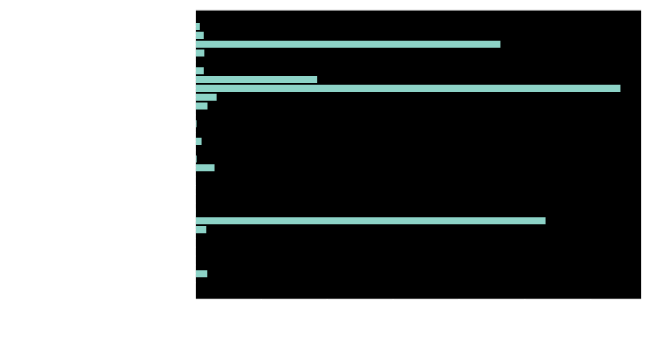

* ランダムフォレストと比べて、に似てるが幾つかの特徴量が完全に無視されているのがわかる
* 一般的にはランダムフォレストを先に試して、精度をあげたい時とかに勾配するといいらしい


### カーネル方を用いたサポートベクタマシン

```
from sklearn.datasets import make_blobs

X,y = make_blobs(centers=4,random_state=8)
y = y % 2

mglearn.discrete_scatter(X[:,0],X[:,1],y)
plt.xlabel("Feature 0")
plt.ylabel("Feature 1")
```

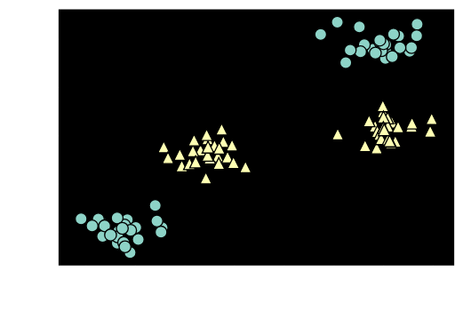

* 線形モデルのクラス分類は直線でしか分類できないので、こういうデータセットではうまくいかない

```
from sklearn.svm import LinearSVC
linear_svm = LinearSVC().fit(X,y)
mglearn.plots.plot_2d_separator(linear_svm,X)
mglearn.discrete_scatter(X[:,0],X[:,1],y)
plt.xlabel("Feature 0")
plt.ylabel("Feature 1")
```
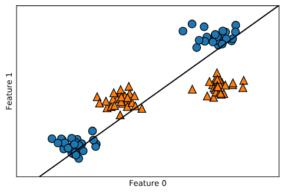

* こいつを3次元のデータにしてやる
* やり方は feature1 ** 2 , つまり2番目の特徴量の2乗を3番目の特徴量としてやる

```
# 2番目の特徴量の2乗を追加
X_new = np.hstack([X,X[:,1:]**2])

from mpl_toolkits.mplot3d import Axes3D, axes3d
figure = plt.figure()
# 3Dで可視化

ax = Axes3D(figure , elev=-152 , azim=-26)
# y == 0の点をプロットしてから y==1の点をプロット
mask = y == 0
ax.scatter(X_new[mask,0] , X_new[mask,1] , X_new[mask,2],c='b',cmap=mglearn.cm2,s=60)
ax.scatter(X_new[~mask,0] , X_new[~mask,1] , X_new[~mask,2],c='r',marker='^',cmap=mglearn.cm2,s=60)
ax.set_xlabel=("feature 0")
ax.set_ylabel=("feature 1")
ax.set_zlabel=("feature1 ** 2")

```

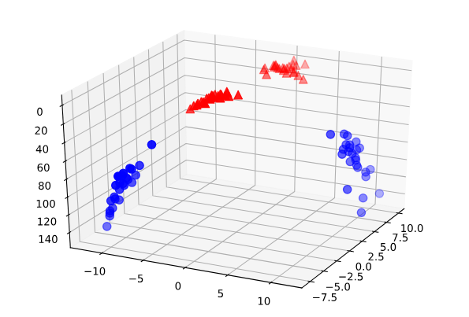

* 3Dになった！
