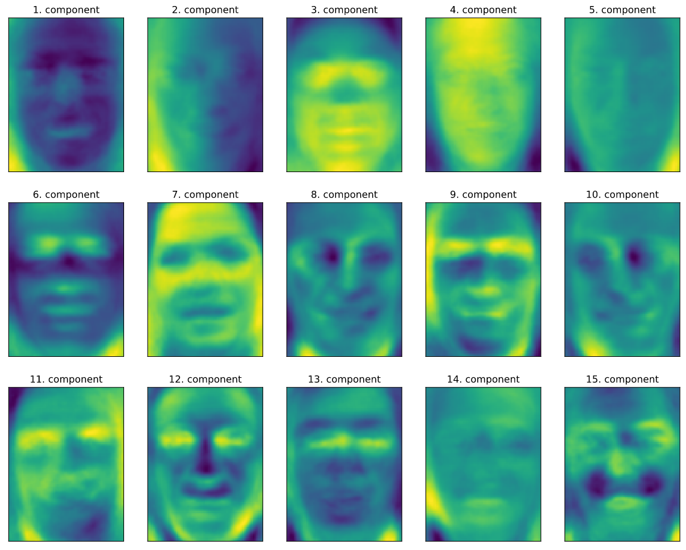

# 教師なし学習と前処理

教師なし学習ではアルゴリズムには入力データだけ与えられ、そこから知識を抽出する事が要求される。


## 教師なし学習の種類

* データセットの変換

    * データセットの教師なし変換(Unsupervised transformations)

        元のデータ表現を変換して人間や他の機械学習アルゴにとって、わかりやすい新しいデータ表現を作るアルゴ

        #### 最も一般的な利用法は次元削減である

        他には、データを「構成する」部品、成分を見つける事。

        #### 例えば、文章データからトピックを抽出する

* クラスタリング

    * クラスタリングアルゴリズム(Clustering algorithms)

        データを似たような要素から構成されるグループに分けるアルゴリズム

        #### 例えば、SNSサイトにアップされた写真の中から同じ人を抽出する

の2つがある。

## 教師なし学習の難しさ

アルゴリズムが学習したことの有用性の評価。結果を人間が確かめるしかない場合とか。

なので、教師あり学習の前処理ステップとして利用する事があったりする。


## 前処理とスケール変換

教師あり学習では、ニューラルネットワークやVMなどのアルゴはデータのスケール変換が重要って話があった。

よく使われるのは、特徴量ごとにスケールを変換してずらす方法


```
mglearn.plots.plot_scaling()
```


scikit-learnに

* StandardScaler
* RobustScaler
* MinMaxScaler
* Normalizer

とかがある。


## データ変換やってみる


```
from sklearn.datasets import load_breast_cancer
from sklearn.model_selection import train_test_split
cancer = load_breast_cancer()

X_train , X_test , y_train , y_test = train_test_split(cancer.data,cancer.target , random_state=1)

print(X_train.shape)
print(X_test.shape)

>> (426, 30)
>> (143, 30)
``` 

教師なし学習なんだけど、前処理した後に構築する教師ありモデルを評価するために訓練セットとテストセットに分けてる

```
from sklearn.preprocessing import MinMaxScaler
scaler = MinMaxScaler()
scaler.fit(X_train)

>> MinMaxScaler(copy=True, feature_range=(0, 1))
```

fitメソッドを訓練データに適合させる。MinMaxScalerのfitメソッドはデータの各特徴量の最小値と最大値を計算する。教師ありのクラス分類とは違って、X_trainのみで教師データは用いない

学習した変換を実際に適応する(スケール変換する)にはスケール変換器の transform メソッドを用いる。


```
X_train_scaled = scaler.transform(X_train)

print("transformed shape : {}".format(X_train_scaled.shape))
print("pre-freature minimum before scaling:\n {}".format(X_train.min(axis=0)))
print("pre-freature maximum before scaling:\n {}".format(X_train.max(axis=0)))
print("pre-freature minimum after scaling:\n {}".format(X_train_scaled.min(axis=0)))
print("pre-freature maximum before scaling:\n {}".format(X_train_scaled.max(axis=0)))

>> transformed shape : (426, 30)
>> pre-freature minimum before scaling:
>>  [6.981e+00 9.710e+00 4.379e+01 1.435e+02 5.263e-02 1.938e-02 0.000e+00
>>  0.000e+00 1.060e-01 5.024e-02 1.153e-01 3.602e-01 7.570e-01 6.802e+00
>>  1.713e-03 2.252e-03 0.000e+00 0.000e+00 9.539e-03 8.948e-04 7.930e+00
>>  1.202e+01 5.041e+01 1.852e+02 7.117e-02 2.729e-02 0.000e+00 0.000e+00
>>  1.566e-01 5.521e-02]
>> pre-freature maximum before scaling:
>>  [2.811e+01 3.928e+01 1.885e+02 2.501e+03 1.634e-01 2.867e-01 4.268e-01
>>  2.012e-01 3.040e-01 9.575e-02 2.873e+00 4.885e+00 2.198e+01 5.422e+02
>>  3.113e-02 1.354e-01 3.960e-01 5.279e-02 6.146e-02 2.984e-02 3.604e+01
>>  4.954e+01 2.512e+02 4.254e+03 2.226e-01 9.379e-01 1.170e+00 2.910e-01
>>  5.774e-01 1.486e-01]
>> pre-freature minimum after scaling:
>>  [0. 0. 0. 0. 0. 0. 0. 0. 0. 0. 0. 0. 0. 0. 0. 0. 0. 0. 0. 0. 0. 0. 0. 0.
>>  0. 0. 0. 0. 0. 0.]
>> pre-freature maximum before scaling:
>>  [1. 1. 1. 1. 1. 1. 1. 1. 1. 1. 1. 1. 1. 1. 1. 1. 1. 1. 1. 1. 1. 1. 1. 1.
>>  1. 1. 1. 1. 1. 1.]

```

変換されたデータの配列は元の形と同じだけど、特徴量がシフトされて0と1になっている。

同じく、X_testにも適応してやる。

```
X_test_scaled = scaler.transform(X_test)

print("pre-feature minimum after scaling:\n {}".format(X_test_scaled.min(axis=0)))
print("pre-feature maximum after scaling:\n {}".format(X_test_scaled.max(axis=0)))

>> pre-feature minimum after scaling:
>>  [ 0.0336031   0.0226581   0.03144219  0.01141039  0.14128374  0.04406704
>>   0.          0.          0.1540404  -0.00615249 -0.00137796  0.00594501
>>   0.00430665  0.00079567  0.03919502  0.0112206   0.          0.
>>  -0.03191387  0.00664013  0.02660975  0.05810235  0.02031974  0.00943767
>>   0.1094235   0.02637792  0.          0.         -0.00023764 -0.00182032]
>> pre-feature maximum after scaling:
>>  [0.9578778  0.81501522 0.95577362 0.89353128 0.81132075 1.21958701
>>  0.87956888 0.9333996  0.93232323 1.0371347  0.42669616 0.49765736
>>  0.44117231 0.28371044 0.48703131 0.73863671 0.76717172 0.62928585
>>  1.33685792 0.39057253 0.89612238 0.79317697 0.84859804 0.74488793
>>  0.9154725  1.13188961 1.07008547 0.92371134 1.20532319 1.63068851]

```

テストデータの方は、スケール変換後の最小と最大の値が0と1になっていない！特徴量によっては1をはみ出ている。

これは、MinMaxScalerが訓練データとテストデータに全く同じ変換を施すから。transformメソッドは訓練データの最小値と最大値を引き継ぎ、訓練データのレンジで割るからだ。


## 訓練データとテストデータを同じように変換する

テストセットを訓練セットと全く同じスケールで変換するのはめちゃくちゃ重要。

試しに、テストセットの最小値とレンジを使うと何が起こるかを示す。

```
from sklearn.datasets import make_blobs
# 合成データを作成
X, _ = make_blobs(n_samples=50,centers=5,random_state=4,cluster_std=2)

# 訓練セットとテストセットをプロット
X_train , X_test = train_test_split(X,random_state=5,test_size=.1)

fig,axes = plt.subplots(1,3,figsize=(13,4))
axes[0].scatter(X_train[:,0],X_train[:,1],c=mglearn.cm2(0),label="Training set",s=60)
axes[0].scatter(X_test[:,0],X_test[:,1],marker="^",c=mglearn.cm2(1),label="Test set",s=60)
axes[0].legend(loc="upper left")
axes[0].set_title("Original Data")

# MinMaxScalerでデータ変換
scaler = MinMaxScaler()
scaler.fit(X_train)
X_train_scaled = scaler.transform(X_train)
X_test_scaled = scaler.transform(X_test)

# スケール変換されたデータの特性を可視化
axes[1].scatter(X_train_scaled[:,0],X_train_scaled[:,1],c=mglearn.cm2(0),label="Training set", s=60)
axes[1].scatter(X_test_scaled[:,0],X_test_scaled[:,1],marker="^",c=mglearn.cm2(1),label="Test set", s=60)
axes[1].set_title("Scaled Data")

# テストセットを訓練セットとは別にスケール変換
# 最小値と最大値が0,1になる。ここではわざとやっているが、「実際にはやってはいけない！」
test_scaler = MinMaxScaler()
test_scaler.fit(X_test)
X_test_scaled_badly = test_scaler.transform(X_test)

# ダメなスケール変換を可視化
axes[2].scatter(X_train_scaled[:,0],X_train_scaled[:,1],c=mglearn.cm2(0),label="Training set", s=60)
axes[2].scatter(X_test_scaled[:,0],X_test_scaled[:,1],marker="^",c=mglearn.cm2(1),label="Test set", s=60)
axes[2].set_title("Improperly Scaled Data")

for ax in axes:
    ax.set_xlabel("Feature 0")
    ax.set_ylabel("Feature 1")

```


一番左は何もいじってないやつ。スケール変換されていないので値の範囲がバラついている。

真ん中が訓練データベースでスケールされたもの。

一番右がダメなやつで、訓練データとテストデータが別々のスケールで変換されている。あかんやつ！


## 教師あり学習における前処理の結果

```
from sklearn.svm import SVC

X_train,X_test,y_train,y_test = train_test_split(cancer.data,cancer.target,random_state=0)

svm = SVC(C=100)
svm.fit(X_train,y_train)
print("Test set accuracy : {:.2f}".format(svm.score(X_test,y_test)))

>> Test set accuracy : 0.63
```
63%くらいの精度

```
# 0-1スケール変換で前処理
scaler = MinMaxScaler()
scaler.fit(X_train)
X_train_scaled = scaler.transform(X_train)
X_test_scaled = scaler.transform(X_test)

# 変換された訓練データで学習さす
svm.fit(X_train_scaled,y_train)

print("Scaled set accuracy : {:.2f}".format(svm.score(X_test_scaled,y_test)))

>> Scaled set accuracy : 0.97
```

めっちゃアガる

```
# 平均を0に分散を1に前処理
from sklearn.preprocessing import StandardScaler
scaler = StandardScaler()
scaler.fit(X_train)
X_train_scaled = scaler.transform(X_train)
X_test_scaled = scaler.transform(X_test)

svm.fit(X_train_scaled,y_train)

print("SVM test accuracy: {:.2f}".format(svm.score(X_test_scaled,y_test)))

>> SVM test accuracy: 0.96
```

Standard Scalerでもめっちゃアガる


## 次元削減、特徴量抽出、多様体学習

教師なし学習のデータ変換の一般的な動機は、可視化、データの圧縮、以降の処理に適した表現の発見(いみわからん)

それらに最もよく使われるアルゴリズムが主成分分析(pricinpal component analysys : PCA)

主成分分析の他に、非負値行列因子分解(non-negative matrix factorization : NMF)と二次元散布図を用いたデータ可視化によく用いられる t-SNE がある。


### 主成分分析(PCA)

主成分分析とは、データセットの特徴量を相互に統計的に関連しないように回転する手法。

多くの場合、回転したあとの特徴量からデータを説明するのに重要な一部の特徴量だけを抜き出す。


137pあたりに説明があるが、全く意味がわからん。

#### cancerデータセットのPCAによる可視化

cancerデータは特徴量が30もあるので、たいへん。ちゃんとやると、30×29/2=435の散布図ができてしまうし、理解なんてできない。

なので、特徴量ごとに良性か悪性の2つのクラスのヒストグラムを書く。

```
fig, axes = plt.subplots(15,2,figsize=(10,20))
malignant = cancer.data[cancer.target == 0]
benign = cancer.data[cancer.target == 1]

ax = axes.ravel()

for i in range(30):
    _, bins = np.histogram(cancer.data[:,i],bins=50)
    ax[i].hist(malignant[:,i],bins=bins,color=mglearn.cm3(0),alpha=.5)
    ax[i].hist(benign[:,i],bins=bins,color=mglearn.cm3(2),alpha=.5)
    ax[i].set_title(cancer.feature_names[i])
    ax[i].set_yticks(())

ax[0].set_xlabel("Feature magnitude")
ax[0].set_ylabel("Frequency")
ax[0].legend(["malignant","benign"],loc="best")
fig.tight_layout()

```


個々のデータポイントの特徴量が特定のレンジ(ビンと呼ぶ)に何回入ったか数えることで特徴量ごとにヒストグラムを作っている。

malignant：悪性(青)

benign：良性(緑)

のデータがそれぞれどういう分布になっているかがよくわかる。(これによって、どの特徴量が良性と悪性を見分けるのに使えそうかわかる)

例えば「smoothness error」とかは値が被っていて使えなさそうなのがわかる。逆に「worst concave points」はほとんど重なっていないので良さげ。

しかしこれを見てもここの特徴量の相関やそれがクラス分類に与える影響についてはわからない（わからんの？）、そこでPCAの出番。

PCAると、主な相関を捉える事ができるのでもう少し全体像が見やすくなる。


```
from sklearn.datasets import load_breast_cancer
cancer = load_breast_cancer()

scaler = StandardScaler()
scaler.fit(cancer.data)
X_test_scaled = scaler.transform(cancer.data)
```

PCAを用いる前に、StandardScalerでスケール変換して、個々の特徴量の分散が1になるようにする。

PCA変換の学習と適用は前処理と同じように簡単にできる。PCAオブジェクト作って、fitしてtransformするだけ。これで回転と次元削減を行ってくれる。

デフォルトだとデータの回転とシフトしか行わず、全ての主成分を維持する。データの次元削減を行うにはPCAオブジェクトを作る際に、維持する主成分の数を指定する必要がある

```
from sklearn.decomposition import PCA

# データの最初の2つの主成分だけ維持する
pca = PCA(n_components=2)
# cancerデータにPCAモデルを適合
pca.fit(X_scaled)

# 最初の2つの主成分に対してデータポイントを変換
x_pca = pca.transform(X_scaled)
print("Origin shape: {}".format(str(X_scaled.shape)))
print("Reduced shape: {}".format(str(x_pca.shape)))

>> Origin shape: (569, 30)
>> Reduced shape: (569, 2)
```

```
# 第一主成分と第二主成分のプロット、クラスごとに色分け
plt.figure(figsize=(8,8))
mglearn.discrete_scatter(x_pca[:,0],x_pca[:,1],cancer.target)
plt.legend(cancer.target_names,loc="best")
plt.gca().set_aspect("equal")
plt.xlabel("First principal component")
plt.ylabel("Second principal component")
```


これはつまり、第一主成分に対して第二主成分をクラス情報を使って相関をプロットしたの図。

教師なしなんだけど、結構いい感じに別れている。悪性のデータポイントは良性に比べて広範囲に分布しているのもわかる。


#### 固有顔による特徴量抽出

PCAのもう一つの利用方法は特徴量抽出、画像関連など。

```
from sklearn.datasets import fetch_lfw_people
people = fetch_lfw_people(min_faces_per_person=20,resize=0.7)
image_shape = people.images[0].shape

fix,axes = plt.subplots(2,5,figsize=(15,8),subplot_kw={'xticks':(),'yticks':()})
for target , image , ax in zip(people.target,people.images,axes.ravel()):
    ax.imshow(image)
    ax.set_title(people.target_names[target])

```


```
print("people.images.shape: {}".format(people.images.shape))
print("Number of classes: {}".format(len(people.target_names)))

>> people.images.shape: (3023, 87, 65)
>> Number of classes: 62

```

```
# 各ターゲットの出現回数をカウント
counts = np.bincount(people.target)
# ターゲット名と出現回数を並べて表示
for i , (count,name) in enumerate(zip(counts,people.target_names)):
    print("{0:25} {1:3}".format(name,count),end='   ')
    if (i + 1) % 3 == 0:
        print()


>> Alejandro Toledo           39   Alvaro Uribe               35   Amelie Mauresmo            21   
>> Andre Agassi               36   Angelina Jolie             20   Ariel Sharon               77   
>> Arnold Schwarzenegger      42   Atal Bihari Vajpayee       24   Bill Clinton               29   
>> Carlos Menem               21   Colin Powell              236   David Beckham              31   
>> Donald Rumsfeld           121   George Robertson           22   George W Bush             530   
>> Gerhard Schroeder         109   Gloria Macapagal Arroyo    44   Gray Davis                 26   
>> Guillermo Coria            30   Hamid Karzai               22   Hans Blix                  39   
>> Hugo Chavez                71   Igor Ivanov                20   Jack Straw                 28   
>> Jacques Chirac             52   Jean Chretien              55   Jennifer Aniston           21   
>> Jennifer Capriati          42   Jennifer Lopez             21   Jeremy Greenstock          24   
>> Jiang Zemin                20   John Ashcroft              53   John Negroponte            31   
>> Jose Maria Aznar           23   Juan Carlos Ferrero        28   Junichiro Koizumi          60   
>> Kofi Annan                 32   Laura Bush                 41   Lindsay Davenport          22   
>> Lleyton Hewitt             41   Luiz Inacio Lula da Silva  48   Mahmoud Abbas              29   
>> Megawati Sukarnoputri      33   Michael Bloomberg          20   Naomi Watts                22   
>> Nestor Kirchner            37   Paul Bremer                20   Pete Sampras               22   
>> Recep Tayyip Erdogan       30   Ricardo Lagos              27   Roh Moo-hyun               32   
>> Rudolph Giuliani           26   Saddam Hussein             23   Serena Williams            52   
>> Silvio Berlusconi          33   Tiger Woods                23   Tom Daschle                25   
>> Tom Ridge                  33   Tony Blair                144   Vicente Fox                32   
>> Vladimir Putin             49   Winona Ryder               24

```

↑この辺のループとか配列の処理がパッと頭に入ってこない。

データが少し偏ってるので、次で最大数50に抑える


```
mask = np.zeros(people.target.shape,dtype=np.bool)
for target in np.unique(people.target):
    mask[np.where(people.target==target)[0][:50]] = 1

X_people = people.data[mask]
y_people = people.target[mask]

# 0から255で表現されている、グレースケールの値0と1の間に変換する
# こうした方が数値的に安定する
X_people = X_people/255.
```

顔認識の一般的なタスクとして、見たことのない顔がデータベースの中と一致するかを判別するタスクがある。

しかし多くの場合、顔データベースにはたくさんの人物が登録されており、同じ人物の画像は少ない（つまり訓練データが少ない）

こういう場合、ほとんどクラス分類器は訓練が難しくなる。さらに新しい人を追加するたびに大きなモデルを再訓練するのは大変。

簡単な方法として、1-最近傍法クラス分類器を使う方法がある。クラス分類しようとしている顔に一番近いものを探す。理論的にはクラスごとに訓練サンプルが1つだけあれば機能するはず。KNeighborsClassifierがどのくらいうまく機能するか見てみる。

```
from sklearn.neighbors import KNeighborsClassifier
# 訓練データとテストデータに分割

X_train , X_test , y_train , y_test = train_test_split(X_people,y_people,stratify=y_people,random_state=0)

# KNeighborsClassifierを1-最近傍法で構築
knn = KNeighborsClassifier(n_neighbors=1)
knn.fit(X_train,y_train)
print("Test set score of 1-nn: {:.2f}".format(knn.score(X_test,y_test)))

>> Test set score of 1-nn: 0.23

```

精度が低い！

ただこれは62クラス分類なので、そこまで悪くはない（ランダムに選択したら 1/62=1.5%）

4回に1回しか当たらない程度の精度ではあるが。

そこでPCAの出番

元のピクセルの空間で距離を系さんするのは顔の近似値を測るのは全く適していない。ピクセル表現で2つの画像を比較するということは、相互の画像の対応するピクセルの値を比較する事になる。例えば同じ画像でも1ピクセルずらすだけで全く違うデータになってしまうから。

主成分に沿った距離を使うことで精度が上げれないか試してみよう。ここではPCAのwhitenオプションを使う。これを使うと主成分が同じスケールになるようにスケール変換する。

PCA変換後にStandardScalerをかけるのと同じ。whitenオプションをつけると、データを回転するだけでなく楕円ではなく円を描くようにスケール変換することになる。


イメージはこんな↑感じ

PCAオブジェクトを訓練して最初の100主成分を抜き出す。そのあと訓練データとテストデータを変換する

```
pca = PCA(n_components=100,whiten=True,random_state=0).fit(X_train)
X_train_pca = pca.transform(X_train)
X_test_pca = pca.transform(X_test)

print("X_train_pca.shape : {}".format(X_train_pca.shape))

>> X_train_pca.shape : (1547, 100)

```

新しいデータは100の特徴量を持つ。主成分の最初の100要素。これを使って1-最近傍法クラス分類器にかけてみる。


```
knn = KNeighborsClassifier(n_neighbors=1)
knn.fit(X_train_pca,y_train)
print("Test set accuracy: {:.2f}".format(knn.score(X_test_pca,y_test)))

>> Test set accuracy: 0.31
```

10%くらい上がった。

画像データは見つけた主成分を簡単に可視化できる。

```
print("pca.components_.shape : {}".format(pca.components_.shape))

>> pca.components_.shape : (100, 5655)

fix, axes = plt.subplots(3,5,figsize=(15,12),subplot_kw={'xticks': (),'yticks' : ()})
for i , (component , ax) in enumerate(zip(pca.components_,axes.ravel())):
    ax.imshow(component.reshape(image_shape),cmap='viridis')
    ax.set_title("{}. component".format((i+1)))
```




```
mglearn.plots.plot_pca_faces(X_train,X_test,image_shape)
```


主成分が増えるほど解像度はあがっていくのがわかる。

```
mglearn.discrete_scatter(X_train_pca[:,0],X_train_pca[:,1],y_train)
plt.xlabel("First principal component")
plt.ylabel("Second principal component")
```


顔画像データの散布図。cancerのデータと比べて密集していて分類できなそうなのがわかる。


### 非負値行列因子分解(NMF)

非負値行列因子分解(Non-negative matrix factorization : NMF)も有用な特徴量を抽出する事を目的とした教師無し学習方法。

PCAと似ており、やはり次元削減に用いることができる。

NMFの説明が延々書いてあったけど1ミリもわからん。


#### NMFの顔画像への適用


NMFの方がちょっと悪いらしい。(全然違いわからん)

```
from sklearn.decomposition import NMF
nmf = NMF(n_components=15,random_state=0)
nmf.fit(X_train)
X_train_nmf = nmf.transform(X_train)
X_test_nmf = nmf.transform(X_test)

fix,axes = plt.subplots(3,5,figsize=(15,12),subplot_kw={'xticks':(),'yticks':()})
for i,(component,ax) in enumerate(zip(nmf.components_,axes.ravel())):
    ax.imshow(component.reshape(image_shape))
    ax.set_title("{}. component".format(i))
```


なんやこれ

```
compn = 8
# 8個目(左向いてるっぽいやつ)の成分でソート、最初の10画像を表示

inds = np.argsort(X_train_nmf[:,compn])[::-1]
fig,axes = plt.subplots(2,5,figsize=(15,8),subplot_kw={'xticks':(),'yticks':()})
for i , (ind,ax) in enumerate(zip(inds,axes.ravel())):
    ax.imshow(X_train[ind].reshape(image_shape))

compn = 11
# 11個目(右むいてるっぽいやつ)
inds = np.argsort(X_train_nmf[:,compn])[::-1]
fig,axes = plt.subplots(2,5,figsize=(15,8),subplot_kw={'xticks':(),'yticks':()})
for i , (ind,ax) in enumerate(zip(inds,axes.ravel())):
    ax.imshow(X_train[ind].reshape(image_shape))
```

左向いとるっぽい


右向いとるっぽい


--- 

例えばこんな風に3つの波形が混合されたデータがあるとして

```
S = mglearn.datasets.make_signals()
plt.figure(figsize=(6,1))
plt.plot(S,'-')
plt.xlabel("Time")
plt.ylabel("Signal")
```


```
# データを混ぜて100次元の状態を作る
A = np.random.RandomState(0).uniform(size=(100,3))
X = np.dot(S,A.T)
print("Shape of measurements: {}".format(X.shape))

>> Shape of measurements: (2000, 100)
```

NMFを用いて3つの信号を復元することができる。まじか

```
nmf = NMF(n_components=3,random_state=42)
S_ = nmf.fit_transform(X)
print("Recoverd signal shape: {}".format(S_.shape))

>> Recoverd signal shape: (2000, 3)
```

比較のためにPCAもやっておく

```
pca = PCA(n_components=3)
H = pca.fit_transform(X)
```

```
models = [X,S,S_,H]
names = ['Observations (first three measurements','True sources','NMF recoverd signals','PCA recoverd signals']

fig , axes = plt.subplots(4,figsize=(8,4),gridspec_kw={'hspace':.5},subplot_kw={'xticks':(),'yticks':()})

for model , name ,ax in zip(models,names,axes):
    ax.set_title(name)
    ax.plot(model[:,:3],'-')
```


NMFのほう、いい感じに復元できているっぽい！


### t-SNEを用いた多様体学習

データを変換して散布図で可視化したい時に、まずPCAを試してみるのは悪くないけど、その性質上有用性は限られる。

これに対して可視化によく用いられるのが、多様体学習アルゴリズム(manifold learning algorithms)と呼ばれる一連のアルゴリズム。特に有用なのがt-SNEアルゴリズムである。

多様体学習アルゴリズムは主に可視化に用いられ、ほとんどの場合3以上の新しい特徴量を生成するように利用する事はない。

また、多様体学習アルゴリズムの一部(t-SNEを含む)は訓練データの新たな表現を計算するが、新しいデータを変換する事はできない、つまりテストセットにこのアルゴリズムを適用することはできない。(訓練セットにしか使えない)

多様体学習アルゴリズムは探索的なデータ解析には有効だが、最終的な目標が教師あり学習の場合にはほとんど使われない。

t-SNEはデータポイントの距離を可能な限り維持する2次元表現を見つけようとする。

まず最初に、ランダムは2次元表現を作り、そこから元の特徴空間で近いデータポイントを近くに、遠いポイントは遠くに廃止する。つまり、どの点が近傍か示す情報を維持しようとする。

手書きデータセットに適用してみる。

```
from sklearn.datasets import load_digits
digits = load_digits()

fig, axes = plt.subplots(2,5,figsize=(10,5),subplot_kw={'xticks':(),'yticks':()})
for ax , img in zip(axes.ravel(),digits.images):
    ax.imshow(img)
```


PCAを使って主成分を可視化してみる

```
# PCAモデル構築
pca = PCA(n_components=2)
pca.fit(digits.data)
# 数値データを最初の2主成分で変形
digits_pca = pca.transform(digits.data)
colors = ["#476A2A","#7851B8","#BD3430","#4A2D4E","#875525","#A83683","#4E655E","#853541","#3A3120","#535D8E"]
plt.figure(figsize=(10,10))
plt.xlim(digits_pca[:,0].min(),digits_pca[:,0].max())
plt.ylim(digits_pca[:,1].min(),digits_pca[:,1].max())
for i in range(len(digits.data)):
    # 散布図を数字でプロット
    plt.text(digits_pca[i,0],digits_pca[i,1],str(digits.target[i]),color=colors[digits.target[i]],fontdict={'weight':'bold','size':9})
plt.xlabel("First pricipal component")
plt.ylabel("Second pricipal component")
```


0と6と4とかは結構分類できてるけど、それ以外は結構重なってしまっている。

t-SNEを試してみる。


```
from sklearn.manifold import TSNE
tsne = TSNE(random_state=42)
# fitではなく、fit_transformを用いる。TSNEにはtransformメソッドはない
digits_tsne = tsne.fit_transform(digits.data)

plt.figure(figsize=(10,10))
plt.xlim(digits_tsne[:,0].min(),digits_tsne[:,0].max())
plt.ylim(digits_tsne[:,1].min(),digits_tsne[:,1].max())
for i in range(len(digits.data)):
    # 散布図を数字でプロット
    plt.text(digits_tsne[i,0],digits_tsne[i,1],str(digits.target[i]),color=colors[digits.target[i]],fontdict={'weight':'bold','size':9})
plt.xlabel("t-SNE feature 0")
plt.ylabel("t-SNE feature 1")
```


めちゃくちゃ綺麗に分類されとる！

t-SNEにはパラメータがいくつかあるが、大抵そのままでいい。


## クラスタリング

クラスタリングとはデータセットを「クラスタ」と呼ばれるグループに分割するタスク。

個々のデータポイントにその点が属するクラスタを表す数字を割り当てる(予測する)


### k-meansクラスタリング

最も単純で広く用いられるクラスタリングアルゴリズム。

データ領域を代表するようなクラスタ重心を見つけようとする。

個々のデータを最寄りのクラスタ重心に割り当てる→個々のクラスタ重心をその点に割り当てられたデータポイントの平均に設定する、を未割り当てのデータポイントが無くなるまで繰り返す。


データポイントを丸、クラスタ重心を三角で表している。

```
from sklearn.datasets import make_blobs
from sklearn.cluster import KMeans

# 合成2次元データを作る
X,y = make_blobs(random_state=1)

# クラスタリングモデルを作る
kmeans = KMeans(n_clusters=3)
kmeans.fit(X)

print("Cluster memberships: \n{}".format(kmeans.labels_))

>> Cluster memberships: 
>> [0 1 1 1 2 2 2 1 0 0 1 1 2 0 2 2 2 0 1 1 2 1 2 0 1 2 2 0 0 2 0 0 2 0 1 2 1
>> 1 1 2 2 1 0 1 1 2 0 0 0 0 1 2 2 2 0 2 1 1 0 0 1 2 2 1 1 2 0 2 0 1 1 1 2 0
>> 0 1 2 2 0 1 0 1 1 2 0 0 0 0 1 0 2 0 0 1 1 2 2 0 2 0]

mglearn.discrete_scatter(X[:,0],X[:,1],kmeans.labels_ , markers='o')
mglearn.discrete_scatter(kmeans.cluster_centers_[:,0],kmeans.cluster_centers_[:,1],[0,1,2],markers='^',markeredgewidth=2)

```


n_clustersをいじってやればクラスタ数を変えることもできる。


#### k-meansがうまくいかない場合

データセットに対して、「正しい」クラスタの数がわかっていたとしても、k-meansがそれをうまく見つけられるとは限らない。

k-meansでは比較的単純な形しか見つけられない。

```
X_varied,y_varied = make_blobs(n_samples=200,cluster_std=[1.0,2.5,0.5],random_state=170)
y_pred = KMeans(n_clusters=3,random_state=0).fit_predict(X_varied)

mglearn.discrete_scatter(X_varied[:,0],X_varied[:,1],y_pred)
plt.legend(["cluster 0","cluster 1","cluster 2"],loc='best')
plt.xlabel("Feature 0")
plt.ylabel("Feature 1")
```


こんな感じになっちゃうことがある。真ん中下あたりの3つのクラスタにやつとかが接近してるとことか？

あとk-meansは丸くないクラスタには向かない(センターからの距離でみるから)

```
# ランダムにクラスタデータを作成
X,y = make_blobs(random_state=170,n_samples=600)
rng = np.random.RandomState(74)

# 対角線方向に引き延ばす
transformation = rng.normal(size=(2,2))
X = np.dot(X,transformation)

# データポイントを3つにクラスタリング
kmeans = KMeans(n_clusters=3)
kmeans.fit(X)
y_pred = kmeans.predict(X)

# クラスタ割り当てとクラスタセンターをプロット
plt.scatter(X[:,0],X[:,1],c=y_pred,cmap=mglearn.cm3)
plt.scatter(kmeans.cluster_centers_[:,0],kmeans.cluster_centers_[:,1],marker='^',c=[0,1,2],s=100,linewidths=2,cmap=mglearn.cm3)
plt.xlabel("Feature0")
plt.ylabel("Feature1")
```


#### ベクトル量子化、成分分解としてのk-means

k-meansはクラスタリングアルゴリズムだが、PCAやNMFなどの成分分解手法と類似性がある。

PCAはデータ中の最も分散が大きい方向群を見つけようとし、NMFは足し込んでいくことができる成分を見つけようとしていた。

共通するのは「データの極端な特徴」と「部品」として捉えて、データポイントを複数の成分の和として表現しようとするところ。かつ、ここのデータポイントをクラスタセンターという1つの成分で表現しおうとしているところ。こういうのをベクトル量子化と呼ぶ。


(途中だいぶ省略、k-meansのデータポイントの数増やすと表現できる幅が増えるんやで〜みたいな。十分なデータポイントの数を与えれば↑の表とかも表現できなくはない。)

#### 凝集型クラスタリング

凝集型クラスタリング(agglomerative clustering) とは。個々のデータポイントをそれぞれ個別のクラスタとして開始し、最も類似した2つのクラスタを併合していく。これを終了条件を満たすまで繰り返す。

「最も類似したクラスタ」を決定する連結(linkage)度には様々なものがある。この連結度は常に2つの既存クラスタ間に定義され、scikit-learnには3つ定義されている。

- ward：デフォルト。併合した際にクラスタないの分散の増分が最小になるように2つのクラスタを選択する。多くの場合比較的同じサイズのクラスタになる。

- average：クラスタ内のすべたのポイント間の距離の平均値が最小の2クラスタを併合する

- complete：最大連結度とも呼ばれる。2ツノクラスタの点間の距離の最大値が最小値となるものを併合する

wardはほとんどのデータセットでうまくいく。クラスタによってデータポイントの数が極端に違う場合はaverageとかcompleteの方がいいかも。

```
mglearn.plots.plot_agglomerative_algorithm()
```


↑の図は2次元データセットに対して3クラスタに分ける過程を示したもの。

最初はそれぞれのポイントがクラスタになっている。ステップごとに最も近い2点がクラスタになっている。

全てのポイントが3つのクラスタに分類された(終了条件)のでアルゴリズムはここで停止している。


#### 階層型クラスタリングとデンドログラム

凝集型クラスタリングを行うと階層型クラスタリング(hierarchical clustering)が行われる。

全ての点は1点しか含まれていないクラスタから最後のクラスタのいずれかに向かっていく。

多次元データを可視化するにはデンドログラム(dendrogram)と呼ばれる方法を使う。ただしscikit-learnは描画をサポートしていないのでSciPyを使う。

SciPyはデータ配列Xを取り、連結性配列(linkage array)を計算する関数を提供する。連結性配列には階層的なクラスタの類似度がエンコードされていて、この連結性配列をSciPyのdendrogram関数に与えるとデンドログラムが描画される。

```
# SciPyからデンドログラム関数とwardクラスタリング関数をインポート
from scipy.cluster.hierarchy import dendrogram,ward

X,y = make_blobs(random_state=0,n_samples=12)
# wardクラスタリングをデータ配列Xに適用
# SciPyのward関数は凝集型クラスタリングを行った際のブリッジ距離を示す配列を返す
linkage_array = ward(X)
# このlinkage_arrayに入っているクラスタ間距離をデンドログラムとしてプロットする
dendrogram(linkage_array)

# 2つのクラスタと3クラスタの部分での切断を表示する
ax = plt.gca()
bounds = ax.get_xbound()
ax.plot(bounds,[7.25,7.25],'--',c='k')
ax.plot(bounds,[4,4],'--',c='k')

ax.text(bounds[1],7.25,'two clusters',va='center',fontdict={'size':15})
ax.text(bounds[1],4,'three clusters',va='center',fontdict={'size':15})
plt.xlabel("Sample index")
plt.ylabel("Cluster distance")


```


.